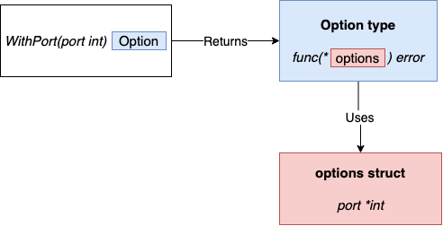

# 100 Go Mistakes and How to Avoid Them

Official repository of 📖 _100 Go Mistakes and How to Avoid Them_, published by Manning in August 2022.

Also available in [Chinese 🇨🇳](README.zh_CN.md).

## ❤️ Sponsor this Repository

Is your company hiring? [Sponsor](https://github.com/sponsors/teivah?frequency=one-time&sponsor=teivah) this repository and let Go developers know your opportunities in this section (traffic: +400 unique visitor per week).

For example:

<details>

<summary>[Company] Remote (USA) - $96,000 to $120,000 a year</summary>

### Job Description

...

### Qualifications

...

</details>

## 📖 Book Description

If you're a Go developer looking to improve your skills, this book is for you. With a focus on practical examples, _100 Go Mistakes and How to Avoid Them_ covers a wide range of topics from concurrency and error handling to testing and code organization. You'll learn to write more idiomatic, efficient, and maintainable code and become a proficient Go developer.

Read the first chapter [here](res/chapter-1.md).


### Quotes

> This should be the required reading for all Golang developers before they touch code in Production... It's the Golang equivalent of the legendary 'Effective Java' by Joshua Bloch.

– _Neeraj Shah_

> Not having this will be the 101st mistake a Go programmer could make.

– _Anupam Sengupta_

### ✍️ About the Author

Teiva Harsanyi is a senior software engineer at Google. He has worked in various domains, including insurance, transportation, and safety-critical industries like air traffic management. He is passionate about Go and how to design and implement reliable systems.

### Where to Buy?

* _100 Go Mistakes and How to Avoid Them_ (🇬🇧 edition: paper, digital, or audiobook):
  * [Manning](https://www.manning.com/books/100-go-mistakes-and-how-to-avoid-them)
  * [O’Reilly](https://www.oreilly.com/library/view/100-go-mistakes/9781617299599/)
  * Amazon: [.com](https://www.amazon.com/dp/1617299596), [.co.uk](https://www.amazon.co.uk/dp/B0BBSNJR6B), [.de](https://www.amazon.de/dp/B0BBHQD8BQ), [.fr](https://www.amazon.fr/100-Mistakes-How-Avoid-Them/dp/1617299596), [.in](https://www.amazon.in/dp/B0BBHQD8BQ), [.co.jp](https://www.amazon.co.jp/dp/B0BBHQD8BQ), [.es](https://www.amazon.es/dp/B0BBHQD8BQ), [.it](https://www.amazon.it/dp/B0BBHQD8BQ), [.com.br](https://www.amazon.com.br/dp/B0BBHQD8BQ)

* _Go言語100Tips 開発者にありがちな間違いへの対処法_ (🇯🇵 edition):
  * Amazon: [.co.jp](https://www.amazon.co.jp/exec/obidos/ASIN/4295017531/)

## 💡 Common Go Mistakes

This section contains a summary of the 100 mistakes in the book. Meanwhile, it's also a section open to the community. If you believe that a mistake should be added, please create a [community mistake issue](https://github.com/teivah/100-go-mistakes/issues/new?assignees=&labels=community+mistake&template=community_mistake.md&title=).

* [Code and Project Organization](#code-and-project-organization)
  * [Unintended variable shadowing](#unintended-variable-shadowing-1)
  * [Unnecessary nested code](#unnecessary-nested-code-2)
  * [Misusing init functions](#misusing-init-functions-3)
  * [Overusing getters and setters](#overusing-getters-and-setters-4)
  * [Interface pollution](#interface-pollution-5)
  * [Interface on the producer side](#interface-on-the-producer-side-6)
  * [Returning interfaces](#returning-interfaces-7)
  * [`any` says nothing](#any-says-nothing-8)
  * [Being confused about when to use generics](#being-confused-about-when-to-use-generics-9)
  * [Not being aware of the possible problems with type embedding](#not-being-aware-of-the-possible-problems-with-type-embedding-10)
  * [Not using the functional options pattern](#not-using-the-functional-options-pattern-11)
  * [Project misorganization](#project-misorganization-project-structure-and-package-organization-12)
  * [Creating utility packages](#creating-utility-packages-13)
  * [Ignoring package name collisions](#ignoring-package-name-collisions-14)
  * [Missing code documentation](#missing-code-documentation-15)
  * [Not using linters](#not-using-linters-16)
* [Data Types](#data-types)
  * [Creating confusion with octal literals](#creating-confusion-with-octal-literals-17)
  * [Neglecting integer overflows](#neglecting-integer-overflows-18)
  * [Not understanding floating-points](#not-understanding-floating-points-19)
  * [Not understanding slice length and capacity](#not-understanding-slice-length-and-capacity-20) ([Read the full excerpt 👀](https://teivah.medium.com/slice-length-vs-capacity-in-go-af71a754b7d8))
  * [Inefficient slice initialization](#inefficient-slice-initialization-21)
  * [Being confused about nil vs. empty slice](#being-confused-about-nil-vs-empty-slice-22)
  * [Not properly checking if a slice is empty](#not-properly-checking-if-a-slice-is-empty-23)
  * [Not making slice copies correctly](#not-making-slice-copies-correctly-24)
  * [Unexpected side effects using slice append](#unexpected-side-effects-using-slice-append-25)
  * [Slice and memory leaks](#slice-and-memory-leaks-26)
  * [Inefficient map initialization](#inefficient-map-initialization-27)
  * [Map and memory leaks](#map-and-memory-leaks-28) ([Read the full excerpt 👀](https://teivah.medium.com/maps-and-memory-leaks-in-go-a85ebe6e7e69))
  * [Comparing values incorrectly](#comparing-values-incorrectly-29)
* [Control Structures](#control-structures)
  * [Ignoring that elements are copied in `range` loops](#ignoring-that-elements-are-copied-in-range-loops-30)
  * [Ignoring how arguments are evaluated in `range` loops](#ignoring-how-arguments-are-evaluated-in-range-loops-channels-and-arrays-31)
  * [Ignoring the impacts of using pointer elements in `range` loops](#ignoring-the-impacts-of-using-pointer-elements-in-range-loops-32)
  * [Making wrong assumptions during map iterations](#making-wrong-assumptions-during-map-iterations-ordering-and-map-insert-during-iteration-33)
  * [Ignoring how the `break` statement works](#ignoring-how-the-break-statement-works-34)
  * [Using defer inside a loop](#using-defer-inside-a-loop-35)
* [Strings](#strings)
  * [Not understanding the concept of rune](#not-understanding-the-concept-of-rune-36)
  * [Inaccurate string iteration](#inaccurate-string-iteration-37)
  * [Misusing trim functions](#misusing-trim-functions-38)
  * [Under-optimized strings concatenation](#under-optimized-strings-concatenation-39)
  * [Useless string conversions](#useless-string-conversions-40)
  * [Substring and memory leaks](#substring-and-memory-leaks-41)
* [Functions and Methods](#functions-and-methods)
  * [Not knowing which type of receiver to use](#not-knowing-which-type-of-receiver-to-use-42)
  * [Never using named result parameters](#never-using-named-result-parameters-43)
  * [Unintended side effects with named result parameters](#unintended-side-effects-with-named-result-parameters-44)
  * [Returning a nil receiver](#returning-a-nil-receiver-45)
  * [Using a filename as a function input](#using-a-filename-as-a-function-input-46)
  * [Ignoring how `defer` arguments and receivers are evaluated](#ignoring-how-defer-arguments-and-receivers-are-evaluated-argument-evaluation-pointer-and-value-receivers-47)
* [Error Management](#error-management)
  * [Panicking](#panicking-48)
  * [Ignoring when to wrap an error](#ignoring-when-to-wrap-an-error-49)
  * [Comparing an error type inaccurately](#comparing-an-error-type-inaccurately-50)
  * [Comparing an error value inaccurately](#comparing-an-error-value-inaccurately-51)
  * [Handling an error twice](#handling-an-error-twice-52)
  * [Not handling an error](#not-handling-an-error-53)
  * [Not handling `defer` errors](#not-handling-defer-errors-54)
* [Concurrency: Foundations](#concurrency-foundations)
  * [Mixing up concurrency and parallelism](#mixing-up-concurrency-and-parallelism-55)
  * [Thinking concurrency is always faster](#thinking-concurrency-is-always-faster-56) ([Read the full excerpt 👀](https://teivah.medium.com/concurrency-isnt-always-faster-in-go-de325168907c))
  * [Being puzzled about when to use channels or mutexes](#being-puzzled-about-when-to-use-channels-or-mutexes-57)
  * [Not understanding race problems](#not-understanding-race-problems-data-races-vs-race-conditions-and-the-go-memory-model-58)
  * [Not understanding the concurrency impacts of a workload type](#not-understanding-the-concurrency-impacts-of-a-workload-type-59)
  * [Misunderstanding Go contexts](#misunderstanding-go-contexts-60)
* [Concurrency: Practice](#concurrency-practice)
  * [Propagating an inappropriate context](#propagating-an-inappropriate-context-61)
  * [Starting a goroutine without knowing when to stop it](#starting-a-goroutine-without-knowing-when-to-stop-it-62)
  * [Not being careful with goroutines and loop variables](#not-being-careful-with-goroutines-and-loop-variables-63)
  * [Expecting a deterministic behavior using select and channels](#expecting-a-deterministic-behavior-using-select-and-channels-64)
  * [Not using notification channels](#not-using-notification-channels-65)
  * [Not using nil channels](#not-using-nil-channels-66)
  * [Being puzzled about channel size](#being-puzzled-about-channel-size-67)
  * [Forgetting about possible side effects with string formatting](#forgetting-about-possible-side-effects-with-string-formatting-etcd-data-race-example-and-deadlock-68)
  * [Creating data races with append](#creating-data-races-with-append-69)
  * [Using mutexes inaccurately with slices and maps](#using-mutexes-inaccurately-with-slices-and-maps-70)
  * [Misusing `sync.WaitGroup`](#misusing-syncwaitgroup-71)
  * [Forgetting about `sync.Cond`](#forgetting-about-synccond-72)
  * [Not using `errgroup`](#not-using-errgroup-73)
  * [Copying a `sync` type](#not-using-errgroup-74)
* [Standard Library](#standard-library)
  * [Providing a wrong time duration](#providing-a-wrong-time-duration-75)
  * [`time.After` and memory leaks](#timeafter-and-memory-leaks-76)
  * [JSON handling common mistakes](#json-handling-common-mistakes-77)
  * [Common SQL mistakes](#common-sql-mistakes-78)
  * [Not closing transient resources](#not-closing-transient-resources-http-body-sqlrows-and-osfile-79)
  * [Forgetting the return statement after replying to an HTTP request](#forgetting-the-return-statement-after-replying-to-an-http-request-80)
  * [Using the default HTTP client and server](#using-the-default-http-client-and-server-81)
* [Testing](#testing)
  * [Not categorizing tests](#not-categorizing-tests-build-tags-environment-variables-and-short-mode-82)
  * [Not enabling the race flag](#not-enabling-the-race-flag-83)
  * [Not using test execution modes](#not-using-test-execution-modes-parallel-and-shuffle-84)
  * [Not using table-driven tests](#not-using-table-driven-tests-85)
  * [Sleeping in unit tests](#sleeping-in-unit-tests-86)
  * [Not dealing with the time API efficiently](#not-dealing-with-the-time-api-efficiently-87)
  * [Not using testing utility packages](#not-using-testing-utility-packages-httptest-and-iotest-88)
  * [Writing inaccurate benchmarks](#writing-inaccurate-benchmarks-89) ([Read the full excerpt 👀](https://teivah.medium.com/how-to-write-accurate-benchmarks-in-go-4266d7dd1a95))
  * [Not exploring all the Go testing features](#not-exploring-all-the-go-testing-features-90)
  * [Not using fuzzing](#not-using-fuzzing-community-mistake) (community mistake)
* [Optimizations](#optimizations)
  * [Not understanding CPU caches](#not-understanding-cpu-caches-91)
  * [Writing concurrent code that leads to false sharing](#writing-concurrent-code-that-leads-to-false-sharing-92)
  * [Not taking into account instruction-level parallelism](#not-taking-into-account-instruction-level-parallelism-93)
  * [Not being aware of data alignment](#not-being-aware-of-data-alignment-94)
  * [Not understanding stack vs. heap](#not-understanding-stack-vs-heap-95)
  * [Not knowing how to reduce allocations](#not-knowing-how-to-reduce-allocations-api-change-compiler-optimizations-and-syncpool-96)
  * [Not relying on inlining](#not-relying-on-inlining-97)
  * [Not using Go diagnostics tooling](#not-using-go-diagnostics-tooling-98) ([Read the full excerpt 👀](https://medium.com/@teivah/profiling-and-execution-tracing-in-go-a5e646970f5b))
  * [Not understanding how the GC works](#not-understanding-how-the-gc-works-99)
  * [Not understanding the impacts of running Go in Docker and Kubernetes](#not-understanding-the-impacts-of-running-go-in-docker-and-kubernetes-100)

### Code and Project Organization

#### Unintended variable shadowing (#1)

**TL;DR**: Avoiding shadowed variables can help prevent mistakes like referencing the wrong variable or confusing readers.

Variable shadowing occurs when a variable name is redeclared in an inner block, but this practice is prone to mistakes. Imposing a rule to forbid shadowed variables depends on personal taste. For example, sometimes it can be convenient to reuse an existing variable name like `err` for errors. Yet, in general, we should remain cautious because we now know that we can face a scenario where the code compiles, but the variable that receives the value is not the one expected.

[[Source code]](02-code-project-organization/1-variable-shadowing/main.go)

#### Unnecessary nested code (#2)

**TL;DR**: Avoiding nested levels and keeping the happy path aligned on the left makes building a mental code model easier.

In general, the more nested levels a function requires, the more complex it is to read and understand. Let’s see some different applications of this rule to optimize our code for readability:

* When an `if` block returns, we should omit the `else` block in all cases. For example, we shouldn’t write:

  ```go
  if foo() {
      // ...
      return true
  } else {
      // ...
  }
  ```

  Instead, we omit the `else` block like this:

  ```go
  if foo() {
      // ...
      return true
  }
  // ...
  ```
* We can also follow this logic with a non-happy path:

  ```go
  if s != "" {
      // ...
  } else {
      return errors.New("empty string")
  }
  ```

  Here, an empty `s` represents the non-happy path. Hence, we should flip the
  condition like so:

  ```go
  if s == "" {
      return errors.New("empty string")
  }
  // ...
  ```

Writing readable code is an important challenge for every developer. Striving to reduce the number of nested blocks, aligning the happy path on the left, and returning as early as possible are concrete means to improve our code’s readability.

[[Source code]](02-code-project-organization/2-nested-code/main.go)

#### Misusing init functions (#3)

**TL;DR**: When initializing variables, remember that init functions have limited error handling and make state handling and testing more complex. In most cases, initializations should be handled as specific functions.

An init function is a function used to initialize the state of an application. It takes no arguments and returns no result (a `func()` function). When a package is initialized, all the constant and variable declarations in the package are evaluated. Then, the init functions are executed.

Init functions can lead to some issues:
* They can limit error management.
* They can complicate how to implement tests (for example, an external dependency must be set up, which may not be necessary for the scope of unit tests).
* If the initialization requires us to set a state, that has to be done through global variables.

We should be cautious with init functions. They can be helpful in some situations, however, such as defining static configuration. Otherwise, and in most cases, we should handle initializations through ad hoc functions.

[[Source code]](02-code-project-organization/3-init-functions/)

#### Overusing getters and setters (#4)

**TL;DR**: Forcing the use of getters and setters isn’t idiomatic in Go. Being pragmatic and finding the right balance between efficiency and blindly following certain idioms should be the way to go.

Data encapsulation refers to hiding the values or state of an object. Getters and setters are means to enable encapsulation by providing exported methods on top of unexported object fields.

In Go, there is no automatic support for getters and setters as we see in some languages. It is also considered neither mandatory nor idiomatic to use getters and setters to access struct fields. We shouldn’t overwhelm our code with getters and setters on structs if they don’t bring any value. We should be pragmatic and strive to find the right balance between efficiency and following idioms that are sometimes considered indisputable in other programming paradigms.

Remember that Go is a unique language designed for many characteristics, including simplicity. However, if we find a need for getters and setters or, as mentioned, foresee a future need while guaranteeing forward compatibility, there’s nothing wrong with using them.

#### Interface pollution (#5)

**TL;DR**: Abstractions should be discovered, not created. To prevent unnecessary complexity, create an interface when you need it and not when you foresee needing it, or if you can at least prove the abstraction to be a valid one.

An interface provides a way to specify the behavior of an object. We use interfaces to create common abstractions that multiple objects can implement. What makes Go interfaces so different is that they are satisfied implicitly. There is no explicit keyword like `implements` to mark that an object `X` implements interface `Y`.

In general, we can define three main use cases where interfaces are generally considered as bringing value: factoring out a common behavior, creating some decoupling, and restricting a type to a certain behavior. Yet, this list isn't exhaustive and will also depend on the context we face.

In many occasions, interfaces are made to create abstractions. And the main caveat when programming meets abstractions is remembering that abstractions should be discovered, not created. What does this mean? It means we shouldn’t start creating abstractions in our code if there is no immediate reason to do so. We shouldn’t design with interfaces but wait for a concrete need. Said differently, we should create an interface when we need it, not when we foresee that we could need it.
What’s the main problem if we overuse interfaces? The answer is that they make the code flow more complex. Adding a useless level of indirection doesn’t bring any value; it creates a worthless abstraction making the code more difficult to read, understand, and reason about. If we don’t have a strong reason for adding an interface and it’s unclear how an interface makes a code better, we should challenge this interface’s purpose. Why not call the implementation directly?

We should be cautious when creating abstractions in our code (abstractions should be discovered, not created). It’s common for us, software developers, to overengineer our code by trying to guess what the perfect level of abstraction is, based on what we think we might need later. This process should be avoided because, in most cases, it pollutes our code with unnecessary abstractions, making it more complex to read.

> Don’t design with interfaces, discover them.

–  _Rob Pike_

Let’s not try to solve a problem abstractly but solve what has to be solved now. Last, but not least, if it’s unclear how an interface makes the code better, we should probably consider removing it to make our code simpler.

[[Source code]](02-code-project-organization/5-interface-pollution/)

#### Interface on the producer side (#6)

**TL;DR**: Keeping interfaces on the client side avoids unnecessary abstractions.

Interfaces are satisfied implicitly in Go, which tends to be a gamechanger compared to languages with an explicit implementation. In most cases, the approach to follow is similar to what we described in the previous section: _abstractions should be discovered, not created_. This means that it’s not up to the producer to force a given abstraction for all the clients. Instead, it’s up to the client to decide whether it needs some form of abstraction and then determine the best abstraction level for its needs.

An interface should live on the consumer side in most cases. However, in particular contexts (for example, when we know—not foresee—that an abstraction will be helpful for consumers), we may want to have it on the producer side. If we do, we should strive to keep it as minimal as possible, increasing its reusability potential and making it more easily composable.

[[Source code]](02-code-project-organization/6-interface-producer/)

#### Returning interfaces (#7)

**TL;DR**: To prevent being restricted in terms of flexibility, a function shouldn’t return interfaces but concrete implementations in most cases. Conversely, a function should accept interfaces whenever possible.

In most cases, we shouldn’t return interfaces but concrete implementations. Otherwise, it can make our design more complex due to package dependencies and can restrict flexibility because all the clients would have to rely on the same abstraction. Again, the conclusion is similar to the previous sections: if we know (not foresee) that an abstraction will be helpful for clients, we can consider returning an interface. Otherwise, we shouldn’t force abstractions; they should be discovered by clients. If a client needs to abstract an implementation for whatever reason, it can still do that on the client’s side.

#### `any` says nothing (#8)

**TL;DR**: Only use `any` if you need to accept or return any possible type, such as `json.Marshal`. Otherwise, `any` doesn’t provide meaningful information and can lead to compile-time issues by allowing a caller to call methods with any data type.

The `any` type can be helpful if there is a genuine need for accepting or returning any possible type (for instance, when it comes to marshaling or formatting). In general, we should avoid overgeneralizing the code we write at all costs. Perhaps a little bit of duplicated code might occasionally be better if it improves other aspects such as code expressiveness.

[[Source code]](02-code-project-organization/8-any/main.go)

#### Being confused about when to use generics (#9)

**TL;DR**: Relying on generics and type parameters can prevent writing boilerplate code to factor out elements or behaviors. However, do not use type parameters prematurely, but only when you see a concrete need for them. Otherwise, they introduce unnecessary abstractions and complexity.

[Read the whole section](res/9-generics.md)

[[Source code]](02-code-project-organization/9-generics/main.go)

#### Not being aware of the possible problems with type embedding (#10)

**TL;DR**: Using type embedding can also help avoid boilerplate code; however, ensure that doing so doesn’t lead to visibility issues where some fields should have remained hidden.

When creating a struct, Go offers the option to embed types. But this can sometimes lead to unexpected behaviors if we don’t understand all the implications of type embedding. Throughout this section, we look at how to embed types, what these bring, and the possible issues.

In Go, a struct field is called embedded if it’s declared without a name. For example,

```cgo
type Foo struct {
    Bar // Embedded field
}

type Bar struct {
    Baz int
}
```

In the `Foo` struct, the `Bar` type is declared without an associated name; hence, it’s an embedded field.

We use embedding to promote the fields and methods of an embedded type. Because Bar contains a Baz field, this field is 
promoted to `Foo`. Therefore, Baz becomes available from Foo.

What can we say about type embedding? First, let’s note that it’s rarely a necessity, and it means that whatever the use case, we can probably solve it as well without type embedding. Type embedding is mainly used for convenience: in most cases, to promote behaviors.

If we decide to use type embedding, we need to keep two main constraints in mind:
* It shouldn’t be used solely as some syntactic sugar to simplify accessing a field (such as `Foo.Baz()` instead of `Foo.Bar.Baz()`). If this is the only rationale, let’s not embed the inner type and use a field instead.
* It shouldn’t promote data (fields) or a behavior (methods) we want to hide from the outside: for example, if it allows clients to access a locking behavior that should remain private to the struct.

Using type embedding consciously by keeping these constraints in mind can help avoid boilerplate code with additional forwarding methods. However, let’s make sure we don’t do it solely for cosmetics and not promote elements that should remain hidden.

[[Source code]](02-code-project-organization/10-type-embedding/main.go)

#### Not using the functional options pattern (#11)

**TL;DR**: To handle options conveniently and in an API-friendly manner, use the functional options pattern.

Although there are different implementations with minor variations, the main idea is as follows:
* An unexported struct holds the configuration: options.
* Each option is a function that returns the same type: `type Option func(options *options)` error. For example, `WithPort` accepts an `int` argument that represents the port and returns an `Option` type that represents how to update the `options` struct.



```go
type options struct {
  port *int
}

type Option func(options *options) error

func WithPort(port int) Option {
  return func(options *options) error {
    if port < 0 {
    return errors.New("port should be positive")
  }
  options.port = &port
  return nil
  }
}

func NewServer(addr string, opts ...Option) ( *http.Server, error) { <1>
  var options options <2>
  for _, opt := range opts { <3>
    err := opt(&options) <4>
    if err != nil {
      return nil, err
    }
  }

  // At this stage, the options struct is built and contains the config
  // Therefore, we can implement our logic related to port configuration
  var port int
  if options.port == nil {
    port = defaultHTTPPort
  } else {
      if *options.port == 0 {
      port = randomPort()
    } else {
      port = *options.port
    }
  }

  // ...
}
```

The functional options pattern provides a handy and API-friendly way to handle options. Although the builder pattern can be a valid option, it has some minor downsides (having to pass a config struct that can be empty or a less handy way to handle error management) that tend to make the functional options pattern the idiomatic way to deal with these kind of problems in Go.

[[Source code]](02-code-project-organization/11-functional-options/)

#### Project misorganization (project structure and package organization) (#12)

**TL;DR**: Following a layout such as [project-layout](https://github.com/golang-standards/project-layout) can be a good way to start structuring Go projects, especially if you are looking for existing conventions to standardize a new project.

Regarding the overall organization, there are different schools of thought. For example, should we organize our application by context or by layer? It depends on our preferences. We may favor grouping code per context (such as the customer context, the contract context, etc.), or we may favor following hexagonal architecture principles and group per technical layer. If the decision we make fits our use case, it cannot be a wrong decision, as long as we remain consistent with it.

Regarding packages, there are multiple best practices that we should follow. First, we should avoid premature packaging because it might cause us to overcomplicate a project. Sometimes, it’s better to use a simple organization and have our project evolve when we understand what it contains rather than forcing ourselves to make the perfect structure up front.
Granularity is another essential thing to consider. We should avoid having dozens of nano packages containing only one or two files. If we do, it’s because we have probably missed some logical connections across these packages, making our project harder for readers to understand. Conversely, we should also avoid huge packages that dilute the meaning of a package name.

Package naming should also be considered with care. As we all know (as developers), naming is hard. To help clients understand a Go project, we should name our packages after what they provide, not what they contain. Also, naming should be meaningful. Therefore, a package name should be short, concise, expressive, and, by convention, a single lowercase word.

Regarding what to export, the rule is pretty straightforward. We should minimize what should be exported as much as possible to reduce the coupling between packages and keep unnecessary exported elements hidden. If we are unsure whether to export an element or not, we should default to not exporting it. Later, if we discover that we need to export it, we can adjust our code. Let’s also keep in mind some exceptions, such as making fields exported so that a struct can be unmarshaled with encoding/json.

Organizing a project isn’t straightforward, but following these rules should help make it easier to maintain. However, remember that consistency is also vital to ease maintainability. Therefore, let’s make sure that we keep things as consistent as possible within a codebase.

#### Creating utility packages (#13)

**TL;DR**: Naming is a critical piece of application design. Creating packages such as `common`, `util`, and `shared` doesn’t bring much value for the reader. Refactor such packages into meaningful and specific package names.

Also, bear in mind that naming a package after what it provides and not what it contains can be an efficient way to increase its expressiveness.

[[Source code]](02-code-project-organization/13-utility-packages/stringset.go)

#### Ignoring package name collisions (#14)

**TL;DR**: To avoid naming collisions between variables and packages, leading to confusion or perhaps even bugs, use unique names for each one. If this isn’t feasible, use an import alias to change the qualifier to differentiate the package name from the variable name, or think of a better name.

Package collisions occur when a variable name collides with an existing package name, preventing the package from being reused. We should prevent variable name collisions to avoid ambiguity. If we face a collision, we should either find another meaningful name or use an import alias.

#### Missing code documentation (#15)

**TL;DR**: To help clients and maintainers understand your code’s purpose, document exported elements.

Documentation is an important aspect of coding. It simplifies how clients can consume an API but can also help in maintaining a project. In Go, we should follow some rules to make our code idiomatic:

First, every exported element must be documented. Whether it is a structure, an interface, a function, or something else, if it’s exported, it must be documented. The convention is to add comments, starting with the name of the exported element.

As a convention, each comment should be a complete sentence that ends with punctuation. Also bear in mind that when we document a function (or a method), we should highlight what the function intends to do, not how it does it; this belongs to the core of a function and comments, not documentation. Furthermore, the documentation should ideally provide enough information that the consumer does not have to look at our code to understand how to use an exported element.

When it comes to documenting a variable or a constant, we might be interested in conveying two aspects: its purpose and its content. The former should live as code documentation to be useful for external clients. The latter, though, shouldn’t necessarily be public.

To help clients and maintainers understand a package’s scope, we should also document each package. The convention is to start the comment with `// Package` followed by the package name. The first line of a package comment should be concise. That’s because it will appear in the package. Then, we can provide all the information we need in the following lines.

Documenting our code shouldn’t be a constraint. We should take the opportunity to make sure it helps clients and maintainers to understand the purpose of our code.

#### Not using linters (#16)

**TL;DR**: To improve code quality and consistency, use linters and formatters.

A linter is an automatic tool to analyze code and catch errors. The scope of this section isn’t to give an exhaustive list of the existing linters; otherwise, it will become deprecated pretty quickly. But we should understand and remember why linters are essential for most Go projects.

However, if you’re not a regular user of linters, here is a list that you may want to use daily:
* https://golang.org/cmd/vet/—A standard Go analyzer
* https://github.com/kisielk/errcheck—An error checker
* https://github.com/fzipp/gocyclo—A cyclomatic complexity analyzer
* https://github.com/jgautheron/goconst—A repeated string constants analyzer
* 
Besides linters, we should also use code formatters to fix code style. Here is a list of some code formatters for you to try:
* https://golang.org/cmd/gofmt/—A standard Go code formatter
* https://godoc.org/golang.org/x/tools/cmd/goimports—A standard Go imports formatter
* 
Meanwhile, we should also look at golangci-lint (https://github.com/golangci/ golangci-lint). It’s a linting tool that provides a facade on top of many useful linters and formatters. Also, it allows running the linters in parallel to improve analysis speed, which is quite handy.

Linters and formatters are a powerful way to improve the quality and consistency of our codebase. Let’s take the time to understand which one we should use and make sure we automate their execution (such as a CI or Git precommit hook).

### Data Types

#### Creating confusion with octal literals (#17)

tldr When reading existing code, bear in mind that integer literals starting with 0 are octal numbers. Also, to improve readability, make octal integers explicit by prefixing them with `0o`.

Octal numbers start with a 0 (e.g., `010` is equal to 8 in base 10). To improve readability and avoid potential mistakes for future code readers, we should make octal numbers explicit using the `0o` prefix (e.g., `0o10`).

We should also note the other integer literal representations:
* _Binary_—Uses a `0b` or `0B` prefix (for example, `0b100` is equal to 4 in base 10)
* _Hexadecimal_—Uses an `0x` or `0X` prefix (for example, `0xF` is equal to 15 in base 10) 
* _Imaginary_—Uses an `i` suffix (for example, `3i`)

We can also use an underscore character (_) as a separator for readability. For example, we can write 1 billion this way: `1_000_000_000`. We can also use the under- score character with other representations (for example, `0b00_00_01`).

[[Source code]](03-data-types/17-octal-literals/main.go)

#### Neglecting integer overflows (#18)

tldr Because integer overflows and underflows are handled silently in Go, you can implement your own functions to catch them.

In Go, an integer overflow that can be detected at compile time generates a compila- tion error. For example,

```cgo
var counter int32 = math.MaxInt32 + 1
```

```shell
constant 2147483648 overflows int32
```

However, at run time, an integer overflow or underflow is silent; this does not lead to an application panic. It is essential to keep this behavior in mind, because it can lead to sneaky bugs (for example, an integer increment or addition of positive integers that leads to a negative result).

[[Source code]](03-data-types/18-integer-overflows)

#### Not understanding floating-points (#19)

tldr Making floating-point comparisons within a given delta can ensure that your code is portable. When performing addition or subtraction, group the operations with a similar order of magnitude to favor accuracy. Also, perform multiplication and division before addition and subtraction.

In Go, there are two floating-point types (if we omit imaginary numbers): float32 and float64. The concept of a floating point was invented to solve the major problem with integers: their inability to represent fractional values. To avoid bad surprises, we need to know that floating-point arithmetic is an approximation of real arithmetic.

For that, we’ll look at a multiplication example:

```go
var n float32 = 1.0001
fmt.Println(n * n)
```

We may expect this code to print the result of 1.0001 * 1.0001 = 1.00020001, right? However, running it on most x86 processors prints 1.0002, instead.

Because Go’s `float32` and `float64` types are approximations, we have to bear a few rules in mind:
* When comparing two floating-point numbers, check that their difference is within an acceptable range.
* When performing additions or subtractions, group operations with a similar order of magnitude for better accuracy.
* To favor accuracy, if a sequence of operations requires addition, subtraction, multiplication, or division, perform the multiplication and division operations first.

[[Source code]](03-data-types/19-floating-points/main.go)

#### Not understanding slice length and capacity (#20)

tldr Understanding the difference between slice length and capacity should be part of a Go developer’s core knowledge. The slice length is the number of available elements in the slice, whereas the slice capacity is the number of elements in the backing array.

TODO

[[Source code]](03-data-types/20-slice-length-cap/main.go)

#### Inefficient slice initialization (#21)

tldr When creating a slice, initialize it with a given length or capacity if its length is already known. This reduces the number of allocations and improves performance. The same logic goes for maps, and you need to initialize their size.

While initializing a slice using `make`, we can provide a length and an optional capacity. Forgetting to pass an appropriate value for both of these parameters when it makes sense is a widespread mistake. Indeed, it can lead to multiple copies and additional effort for the GC to clean the temporary backing arrays. Performance-wise, there’s no good reason not to give the Go runtime a helping hand.

Our options are to allocate a slice with either a given capacity or a given length. Of these two solutions, we have seen that the second tends to be slightly faster. But using a given capacity and append can be easier to implement and read in some contexts.

[[Source code]](03-data-types/21-slice-init/main.go)

#### Being confused about nil vs. empty slice (#22)

tldr To prevent common confusions such as when using the `encoding/json` or the `reflect` package, you need to understand the difference between nil and empty slices. Both are zero-length, zero-capacity slices, but only a nil slice doesn’t require allocation.

In Go, there is a distinction between nil and empty slices. A nil slice is equals to `nil`, whereas an empty slice has a length of zero. A nil slice is empty, but an empty slice isn’t necessarily `nil`. Meanwhile, a nil slice doesn’t require any allocation. We have seen throughout this section how to initialize a slice depending on the con- text by using

* `var s []string` if we aren’t sure about the final length and the slice can be empty
* `[]string(nil)` as syntactic sugar to create a nil and empty slice 
* `make([]string, length)` if the future length is known
 
The last option, `[]string{}`, should be avoided if we initialize the slice without ele- ments. Finally, let’s check whether the libraries we use make the distinctions between nil and empty slices to prevent unexpected behaviors.

[[Source code]](03-data-types/22-nil-empty-slice/)

#### Not properly checking if a slice is empty (#23)

tldr To check if a slice doesn’t contain any element, check its length. This check works regardless of whether the slice is `nil` or empty. The same goes for maps. To design unambiguous APIs, you shouldn’t distinguish between nil and empty slices.

To determine whether a slice has elements, we can either do it by checking if the slice is nil or if its length is equal to 0. Checking the length is the best option to follow as it will cover both if the slice is empty or is the slice is nil.

Meanwhile, when designing interfaces, we should avoid distinguishing nil and empty slices, which leads to subtle programming errors. When returning slices, it should make neither a seman- tic nor a technical difference if we return a nil or empty slice. Both should mean the same thing for the callers. This principle is the same with maps. To check if a map is empty, check its length, not whether it’s nil.

[[Source code]](03-data-types/23-checking-slice-empty/main.go)

#### Not making slice copies correctly (#24)

tldr To copy one slice to another using the `copy` built-in function, remember that the number of copied elements corresponds to the minimum between the two slice’s lengths.

Copying elements from one slice to another is a reasonably frequent operation. When using copy, we must recall that the number of elements copied to the destina- tion corresponds to the minimum between the two slices’ lengths. Also bear in mind that other alternatives exist to copy a slice, so we shouldn’t be surprised if we find them in a codebase.

[[Source code]](03-data-types/24-slice-copy/main.go)

#### Unexpected side effects using slice append (#25)

Using copy or the full slice expression is a way to prevent `append` from creating conflicts if two different functions use slices backed by the same array. However, only a slice copy prevents memory leaks if you want to shrink a large slice.

[[Source code]](03-data-types/25-slice-append/main.go)

#### Slice and memory leaks (#26)

Working with a slice of pointers or structs with pointer fields, you can avoid memory leaks by marking as nil the elements excluded by a slicing operation.

[[Source code]](03-data-types/26-slice-memory-leak/)

#### Inefficient map initialization (#27)

See [#21](#inefficient-slice-initialization-21).

[[Source code]](03-data-types/27-map-init/main_test.go)

#### [Map and memory leaks](https://teivah.medium.com/maps-and-memory-leaks-in-go-a85ebe6e7e69) (#28)

A map can always grow in memory, but it never shrinks. Hence, if it leads to some memory issues, you can try different options, such as forcing Go to recreate the map or using pointers.

[[Source code]](03-data-types/28-map-memory-leak/main.go)

#### Comparing values incorrectly (#29)

To compare types in Go, you can use the == and != operators if two types are comparable: Booleans, numerals, strings, pointers, channels, and structs are composed entirely of comparable types. Otherwise, you can either use `reflect.DeepEqual` and pay the price of reflection or use custom implementations and libraries.

[[Source code]](03-data-types/29-comparing-values/main.go)

### Control Structures

#### Ignoring that elements are copied in `range` loops (#30)

The value element in a `range` loop is a copy. Therefore, to mutate a struct, for example, access it via its index or via a classic `for` loop (unless the element or the field you want to modify is a pointer).

[[Source code]](04-control-structures/30-range-loop-element-copied/)

#### Ignoring how arguments are evaluated in `range` loops (channels and arrays) (#31)

Understanding that the expression passed to the `range` operator is evaluated only once before the beginning of the loop can help you avoid common mistakes such as inefficient assignment in channel or slice iteration.

[[Source code]](04-control-structures/31-range-loop-arg-evaluation/)

#### Ignoring the impacts of using pointer elements in `range` loops (#32)

Using a local variable or accessing an element using an index, you can prevent mistakes while copying pointers inside a loop.

[[Source code]](04-control-structures/32-range-loop-pointers/)

#### Making wrong assumptions during map iterations (ordering and map insert during iteration) (#33)

To ensure predictable outputs when using maps, remember that a map data structure:
* Doesn’t order the data by keys
* Doesn’t preserve the insertion order
* Doesn’t have a deterministic iteration order
* Doesn’t guarantee that an element added during an iteration will be produced during this iteration

[[Source code]](04-control-structures/33-map-iteration/main.go)

#### Ignoring how the `break` statement works (#34)

Using `break` or `continue` with a label enforces breaking a specific statement. This can be helpful with `switch` or `select` statements inside loops.

[[Source code]](04-control-structures/34-break/main.go)

#### Using `defer` inside a loop (#35)

Extracting loop logic inside a function leads to executing a `defer` statement at the end of each iteration.

[[Source code]](04-control-structures/35-defer-loop/main.go)

### Strings

#### Not understanding the concept of rune (#36)

Understanding that a rune corresponds to the concept of a Unicode code point and that it can be composed of multiple bytes should be part of the Go developer’s core knowledge to work accurately with strings.

[[Source code]](05-strings/36-rune/main.go)

#### Inaccurate string iteration (#37)

Iterating on a string with the `range` operator iterates on the runes with the index corresponding to the starting index of the rune’s byte sequence. To access a specific rune index (such as the third rune), convert the string into a `[]rune`.

[[Source code]](05-strings/37-string-iteration/main.go)

#### Misusing trim functions (#38)

`strings.TrimRight`/`strings.TrimLeft` removes all the trailing/leading runes contained in a given set, whereas `strings.TrimSuffix`/`strings.TrimPrefix` returns a string without a provided suffix/prefix.

[[Source code]](05-strings/38-trim/main.go)

#### Under-optimized strings concatenation (#39)

Concatenating a list of strings should be done with `strings.Builder` to prevent allocating a new string during each iteration.

[[Source code]](05-strings/39-string-concat/)

#### Useless string conversions (#40)

Remembering that the `bytes` package offers the same operations as the `strings` package can help avoid extra byte/string conversions.

[[Source code]](05-strings/40-string-conversion/main.go)

#### Substring and memory leaks (#41)

Using copies instead of substrings can prevent memory leaks, as the string returned by a substring operation will be backed by the same byte array.

[[Source code]](05-strings/41-substring-memory-leak/main.go)

### Functions and Methods

#### Not knowing which type of receiver to use (#42)

The decision whether to use a value or a pointer receiver should be made based on factors such as the type, whether it has to be mutated, whether it contains a field that can’t be copied, and how large the object is. When in doubt, use a pointer receiver.

[[Source code]](06-functions-methods/42-receiver/)

#### Never using named result parameters (#43)

Using named result parameters can be an efficient way to improve the readability of a function/method, especially if multiple result parameters have the same type. In some cases, this approach can also be convenient because named result parameters are initialized to their zero value. But be cautious about potential side effects.

[[Source code]](06-functions-methods/43-named-result-parameters/main.go)

#### Unintended side effects with named result parameters (#44)

See [#43](#never-using-named-result-parameters-43).

[[Source code]](06-functions-methods/44-side-effects-named-result-parameters/main.go)

#### Returning a nil receiver (#45)

When returning an interface, be cautious about returning not a nil pointer but an explicit nil value. Otherwise, unintended consequences may result because the caller will receive a non-nil value.

[[Source code]](06-functions-methods/45-nil-receiver/main.go)

#### Using a filename as a function input (#46)

Designing functions to receive `io.Reader` types instead of filenames improves the reusability of a function and makes testing easier.

[[Source code]](06-functions-methods/46-function-input/)

#### Ignoring how `defer` arguments and receivers are evaluated (argument evaluation, pointer, and value receivers) (#47)

Passing a pointer to a `defer` function and wrapping a call inside a closure are two possible solutions to overcome the immediate evaluation of arguments and receivers.

[[Source code]](06-functions-methods/47-defer-evaluation/)

### Error Management

#### Panicking (#48)

Using `panic` is an option to deal with errors in Go. However, it should only be used sparingly in unrecoverable conditions: for example, to signal a programmer error or when you fail to load a mandatory dependency.

[[Source code]](07-error-management/48-panic/main.go)

#### Ignoring when to wrap an error (#49)

Wrapping an error allows you to mark an error and/or provide additional context. However, error wrapping creates potential coupling as it makes the source error available for the caller. If you want to prevent that, don’t use error wrapping.

[[Source code]](07-error-management/49-error-wrapping/main.go)

#### Comparing an error type inaccurately (#50)

If you use Go 1.13 error wrapping with the `%w` directive and `fmt.Errorf`, comparing an error against a type or a value has to be done using `errors.As` or `errors.Is`, respectively. Otherwise, if the returned error you want to check is wrapped, it will fail the checks.

[[Source code]](07-error-management/50-compare-error-type/main.go)

#### Comparing an error value inaccurately (#51)

See [#50](#comparing-an-error-type-inaccurately-50).

To convey an expected error, use error sentinels (error values). An unexpected error should be a specific error type.

[[Source code]](07-error-management/51-comparing-error-value/main.go)

#### Handling an error twice (#52)

In most situations, an error should be handled only once. Logging an error is handling an error. Therefore, you have to choose between logging or returning an error. In many cases, error wrapping is the solution as it allows you to provide additional context to an error and return the source error.

[[Source code]](07-error-management/52-handling-error-twice/main.go)

#### Not handling an error (#53)

Ignoring an error, whether during a function call or in a `defer` function, should be done explicitly using the blank identifier. Otherwise, future readers may be confused about whether it was intentional or a miss.

[[Source code]](07-error-management/53-not-handling-error/main.go)

#### Not handling `defer` errors (#54)

In many cases, you shouldn’t ignore an error returned by a `defer` function. Either handle it directly or propagate it to the caller, depending on the context. If you want to ignore it, use the blank identifier.

[[Source code]](07-error-management/54-defer-errors/main.go)

### Concurrency: Foundations

#### Mixing up concurrency and parallelism (#55)

Understanding the fundamental differences between concurrency and parallelism is a cornerstone of the Go developer’s knowledge. Concurrency is about structure, whereas parallelism is about execution.

#### [Thinking concurrency is always faster](https://teivah.medium.com/concurrency-isnt-always-faster-in-go-de325168907c) (#56)

To be a proficient developer, you must acknowledge that concurrency isn’t always faster. Solutions involving parallelization of minimal workloads may not necessarily be faster than a sequential implementation. Benchmarking sequential versus concurrent solutions should be the way to validate assumptions.

[[Source code]](08-concurrency-foundations/56-faster/)

#### Being puzzled about when to use channels or mutexes (#57)

Being aware of goroutine interactions can also be helpful when deciding between channels and mutexes. In general, parallel goroutines require synchronization and hence mutexes. Conversely, concurrent goroutines generally require coordination and orchestration and hence channels.

#### Not understanding race problems (data races vs. race conditions and the Go memory model) (#58)

Being proficient in concurrency also means understanding that data races and race conditions are different concepts. Data races occur when multiple goroutines simultaneously access the same memory location and at least one of them is writing. Meanwhile, being data-race-free doesn’t necessarily mean deterministic execution. When a behavior depends on the sequence or the timing of events that can’t be controlled, this is a race condition.

Understanding the Go memory model and the underlying guarantees in terms of ordering and synchronization is essential to prevent possible data races and/or race conditions.

[[Source code]](08-concurrency-foundations/58-races/)

#### Not understanding the concurrency impacts of a workload type (#59)

When creating a certain number of goroutines, consider the workload type. Creating CPU-bound goroutines means bounding this number close to the `GOMAXPROCS` variable (based by default on the number of CPU cores on the host). Creating I/O-bound goroutines depends on other factors, such as the external system.

[[Source code]](08-concurrency-foundations/59-workload-type/main.go)

#### Misunderstanding Go contexts (#60)

Go contexts are also one of the cornerstones of concurrency in Go. A context allows you to carry a deadline, a cancellation signal, and/or a list of keys-values.

[[Source code]](08-concurrency-foundations/60-contexts/main.go)

### Concurrency: Practice

#### Propagating an inappropriate context (#61)

Understanding the conditions when a context can be canceled should matter when propagating it: for example, an HTTP handler canceling the context when the response has been sent.

[[Source code]](09-concurrency-practice/61-inappropriate-context/main.go)

#### Starting a goroutine without knowing when to stop it (#62)

Avoiding leaks means being mindful that whenever a goroutine is started, you should have a plan to stop it eventually.

[[Source code]](09-concurrency-practice/62-starting-goroutine/)

#### Not being careful with goroutines and loop variables (#63)

To avoid bugs with goroutines and loop variables, create local variables or call functions instead of closures.

[[Source code]](09-concurrency-practice/63-goroutines-loop-variables/main.go)

#### Expecting a deterministic behavior using select and channels (#64)

Understanding that `select` with multiple channels chooses the case randomly if multiple options are possible prevents making wrong assumptions that can lead to subtle concurrency bugs.

[[Source code]](09-concurrency-practice/64-select-behavior/main.go)

#### Not using notification channels (#65)

Send notifications using a `chan struct{}` type.

#### Not using nil channels (#66)

Using nil channels should be part of your concurrency toolset because it allows you to _remove_ cases from `select` statements, for example.

[[Source code]](09-concurrency-practice/66-nil-channels/main.go)

#### Being puzzled about channel size (#67)

Carefully decide on the right channel type to use, given a problem. Only unbuffered channels provide strong synchronization guarantees.

You should have a good reason to specify a channel size other than one for buffered channels.

#### Forgetting about possible side effects with string formatting (etcd data race example and deadlock) (#68)

Being aware that string formatting may lead to calling existing functions means watching out for possible deadlocks and other data races.

[[Source code]](09-concurrency-practice/68-string-formatting/main.go)

#### Creating data races with append (#69)

Calling `append` isn’t always data-race-free; hence, it shouldn’t be used concurrently on a shared slice.

[[Source code]](09-concurrency-practice/69-data-race-append/main.go)

#### Using mutexes inaccurately with slices and maps (#70)

Remembering that slices and maps are pointers can prevent common data races.

[[Source code]](09-concurrency-practice/70-mutex-slices-maps/main.go)

#### Misusing `sync.WaitGroup` (#71)

To accurately use `sync.WaitGroup`, call the `Add` method before spinning up goroutines.

[[Source code]](09-concurrency-practice/71-wait-group/main.go)

#### Forgetting about `sync.Cond` (#72)

You can send repeated notifications to multiple goroutines with `sync.Cond`.

[[Source code]](09-concurrency-practice/72-cond/main.go)

#### Not using `errgroup` (#73)

You can synchronize a group of goroutines and handle errors and contexts with the `errgroup` package.

[[Source code]](09-concurrency-practice/73-errgroup/main.go)

#### Copying a `sync` type (#74)

`sync` types shouldn’t be copied.

[[Source code]](09-concurrency-practice/74-copying-sync/main.go)

### Standard Library

#### Providing a wrong time duration (#75)

Remain cautious with functions accepting a `time.Duration`. Even though passing an integer is allowed, strive to use the time API to prevent any possible confusion.

[[Source code]](10-standard-lib/75-wrong-time-duration/main.go)

#### `time.After` and memory leaks (#76)

Avoiding calls to `time.After` in repeated functions (such as loops or HTTP handlers) can avoid peak memory consumption. The resources created by `time.After` are released only when the timer expires.

[[Source code]](10-standard-lib/76-time-after/main.go)

#### JSON handling common mistakes (#77)

* Unexpected behavior because of type embedding

  Be careful about using embedded fields in Go structs. Doing so may lead to sneaky bugs like an embedded time.Time field implementing the `json.Marshaler` interface, hence overriding the default marshaling behavior.

[[Source code]](10-standard-lib/77-json-handling/type-embedding/main.go)

* JSON and the monotonic clock

  When comparing two `time.Time` structs, recall that `time.Time` contains both a wall clock and a monotonic clock, and the comparison using the == operator is done on both clocks.

[[Source code]](10-standard-lib/77-json-handling/monotonic-clock/main.go)

* Map of `any`

  To avoid wrong assumptions when you provide a map while unmarshaling JSON data, remember that numerics are converted to `float64` by default.

[[Source code]](10-standard-lib/77-json-handling/map-any/main.go)

#### Common SQL mistakes (#78)

* Forgetting that `sql.Open` doesn't necessarily establish connections to a database

  Call the `Ping` or `PingContext` method if you need to test your configuration and make sure a database is reachable.

[[Source code]](10-standard-lib/78-sql/sql-open)

* Forgetting about connections pooling

  Configure the database connection parameters for production-grade applications.

* Not using prepared statements

  Using SQL prepared statements makes queries more efficient and more secure.
 
[[Source code]](10-standard-lib/78-sql/prepared-statements)

* Mishandling null values

  Deal with nullable columns in tables using pointers or `sql.NullXXX` types.
 
[[Source code]](10-standard-lib/78-sql/null-values/main.go)

* Not handling rows iteration errors

  Call the `Err` method of `sql.Rows` after row iterations to ensure that you haven’t missed an error while preparing the next row.

[[Source code]](10-standard-lib/78-sql/rows-iterations-errors)

#### Not closing transient resources (HTTP body, `sql.Rows`, and `os.File`) (#79)

Eventually close all structs implementing `io.Closer` to avoid possible leaks.

[[Source code]](10-standard-lib/79-closing-resources/)

#### Forgetting the return statement after replying to an HTTP request (#80)

To avoid unexpected behaviors in HTTP handler implementations, make sure you don’t miss the `return` statement if you want a handler to stop after `http.Error`.

[[Source code]](10-standard-lib/80-http-return/main.go)

#### Using the default HTTP client and server (#81)

For production-grade applications, don’t use the default HTTP client and server implementations. These implementations are missing timeouts and behaviors that should be mandatory in production.

[[Source code]](10-standard-lib/81-default-http-client-server/)

### Testing

#### Not categorizing tests (build tags, environment variables, and short mode) (#82)

Categorizing tests using build flags, environment variables, or short mode makes the testing process more efficient. You can create test categories using build flags or environment variables (for example, unit versus integration tests) and differentiate short from long-running tests to decide which kinds of tests to execute.

[[Source code]](11-testing/82-categorizing-tests/)

#### Not enabling the race flag (#83)

Enabling the `-race` flag is highly recommended when writing concurrent applications. Doing so allows you to catch potential data races that can lead to software bugs.

#### Not using test execution modes (parallel and shuffle) (#84)

Using the `-parallel` flag is an efficient way to speed up tests, especially long-running ones.

Use the `-shuffle` flag to help ensure that a test suite doesn’t rely on wrong assumptions that could hide bugs.

#### Not using table-driven tests (#85)

Table-driven tests are an efficient way to group a set of similar tests to prevent code duplication and make future updates easier to handle.

[[Source code]](11-testing/85-table-driven-tests/main_test.go)

#### Sleeping in unit tests (#86)

Avoid sleeps using synchronization to make a test less flaky and more robust. If synchronization isn’t possible, consider a retry approach.

[[Source code]](11-testing/86-sleeping/main_test.go)

#### Not dealing with the time API efficiently (#87)

Understanding how to deal with functions using the time API is another way to make a test less flaky. You can use standard techniques such as handling the time as part of a hidden dependency or asking clients to provide it.

[[Source code]](11-testing/87-time-api/)

#### Not using testing utility packages (`httptest` and `iotest`) (#88)

* The `httptest` package is helpful for dealing with HTTP applications. It provides a set of utilities to test both clients and servers.
* 
[[Source code]](11-testing/88-utility-package/httptest/main_test.go)

* The `iotest` package helps write io.Reader and test that an application is tolerant to errors.

[[Source code]](11-testing/88-utility-package/iotest/main_test.go)

#### [Writing inaccurate benchmarks](https://teivah.medium.com/how-to-write-accurate-benchmarks-in-go-4266d7dd1a95) (#89)

* Not resetting or pausing the timer

  Use time methods to preserve the accuracy of a benchmark.

[[Source code]](11-testing/89-benchmark/timer/main_test.go)

* Making wrong assumptions about micro-benchmarks

  Increasing `benchtime` or using tools such as `benchstat` can be helpful when dealing with micro-benchmarks.

  Be careful with the results of a micro-benchmark if the system that ends up running the application is different from the one running the micro-benchmark.

[[Source code]](11-testing/89-benchmark/wrong-assumptions/main_test.go)

* Not being careful about compiler optimizations

  Make sure the function under test leads to a side effect, to prevent compiler optimizations from fooling you about the benchmark results.
 
[[Source code]](11-testing/89-benchmark/compiler-optimizations/main_test.go)

* Being fooled by the observer effect

  To prevent the observer effect, force a benchmark to re-create the data used by a CPU-bound function.

[[Source code]](11-testing/89-benchmark/observer-effect/main_test.go)

#### Not exploring all the Go testing features (#90)

* Code coverage

  Use code coverage with the `-coverprofile` flag to quickly see which part of the code needs more attention.

* Testing from a different package

  Place unit tests in a different package to enforce writing tests that focus on an exposed behavior, not internals.

[[Source code]](11-testing/90-testing-features/different-package/main_test.go)

* Utility functions

  Handling errors using the `*testing.T` variable instead of the classic `if err != nil` makes code shorter and easier to read.

[[Source code]](11-testing/90-testing-features/utility-function/main_test.go)

* Setup and teardown

  You can use setup and teardown functions to configure a complex environment, such as in the case of integration tests.

[[Source code]](11-testing/90-testing-features/setup-teardown/main_test.go)

#### Not using fuzzing (community mistake)

Fuzzing is an efficient strategy to detect random, unexpected, or malformed inputs to complex functions and methods in order to discover vulnerabilities, bugs, or even potential crashes.

Credits: [@jeromedoucet](https://github.com/jeromedoucet)

### Optimizations

#### Not understanding CPU caches (#91)

* CPU architecture

  Understanding how to use CPU caches is important for optimizing CPU-bound applications because the L1 cache is about 50 to 100 times faster than the main memory.

* Cache line

  Being conscious of the cache line concept is critical to understanding how to organize data in data-intensive applications. A CPU doesn’t fetch memory word by word; instead, it usually copies a memory block to a 64-byte cache line. To get the most out of each individual cache line, enforce spatial locality.

[[Source code]](12-optimizations/91-cpu-caches/cache-line/)

* Slice of structs vs. struct of slices

TODO

[[Source code]](12-optimizations/91-cpu-caches/slice-structs/)

* Predictability

  Making code predictable for the CPU can also be an efficient way to optimize certain functions. For example, a unit or constant stride is predictable for the CPU, but a non-unit stride (for example, a linked list) isn’t predictable.

[[Source code]](12-optimizations/91-cpu-caches/predictability/)

* Cache placement policy

  To avoid a critical stride, hence utilizing only a tiny portion of the cache, be aware that caches are partitioned.

#### Writing concurrent code that leads to false sharing (#92)

Knowing that lower levels of CPU caches aren’t shared across all the cores helps avoid performance-degrading patterns such as false sharing while writing concurrency code. Sharing memory is an illusion.

[[Source code]](12-optimizations/92-false-sharing/)

#### Not taking into account instruction-level parallelism (#93)

Use instruction-level parallelism (ILP) to optimize specific parts of your code to allow a CPU to execute as many parallel instructions as possible. Identifying data hazards is one of the main steps.

[[Source code]](12-optimizations/93-instruction-level-parallelism/)

#### Not being aware of data alignment (#94)

You can avoid common mistakes by remembering that in Go, basic types are aligned with their own size. For example, keep in mind that reorganizing the fields of a struct by size in descending order can lead to more compact structs (less memory allocation and potentially a better spatial locality).

[[Source code]](12-optimizations/94-data-alignment/)

#### Not understanding stack vs. heap (#95)

Understanding the fundamental differences between heap and stack should also be part of your core knowledge when optimizing a Go application. Stack allocations are almost free, whereas heap allocations are slower and rely on the GC to clean the memory.

[[Source code]](12-optimizations/95-stack-heap/)

#### Not knowing how to reduce allocations (API change, compiler optimizations, and `sync.Pool`) (#96)

Reducing allocations is also an essential aspect of optimizing a Go application. This can be done in different ways, such as designing the API carefully to prevent sharing up, understanding the common Go compiler optimizations, and using `sync.Pool`.

[[Source code]](12-optimizations/96-reduce-allocations/)

#### Not relying on inlining (#97)

Use the fast-path inlining technique to efficiently reduce the amortized time to call a function.

#### [Not using Go diagnostics tooling](https://medium.com/@teivah/profiling-and-execution-tracing-in-go-a5e646970f5b) (#98)

Rely on profiling and the execution tracer to understand how an application performs and the parts to optimize.

#### Not understanding how the GC works (#99)

Understanding how to tune the GC can lead to multiple benefits such as handling sudden load increases more efficiently.

#### Not understanding the impacts of running Go in Docker and Kubernetes (#100)

To help avoid CPU throttling when deployed in Docker and Kubernetes, keep in mind that Go isn’t CFS-aware.

## 🌎 External Resources

### English

* How to make mistakes in Go - Go Time #190: [Episode](https://changelog.com/gotime/190), [Spotify](https://open.spotify.com/episode/0K1DImrxHCy6E7zVY4AxMZ?si=akroInsPQ1mM5B5V2tHLUw&dl_branch=1)
* [8LU - 100% Test Coverage](https://youtu.be/V3FBDav6wgQ?t=1210)
* [Some Tips I learned from 100 Mistakes in Go](https://raygervais.dev/articles/2023/04/100_mistakes_in_go/)
* [What can be summarized from 100 Go Mistakes?](https://www.sobyte.net/post/2023-05/summarized-from-100-go-mistakes/)

### Chinese

* [深度阅读之《100 Go Mistakes and How to Avoid Them](https://qcrao.com/post/100-go-mistakes-reading-notes/)
* [100 Go Mistakes 随记](https://zhuanlan.zhihu.com/p/592602656)
* [我为什么放弃Go语言？](https://juejin.cn/post/7241452578125824061)

### Japanese

* [最近読んだGo言語の本の紹介：100 Go Mistakes and How to Avoid Them](https://qiita.com/kentaro_suzuki/items/c9c31dc81217f237433c)
* [『100 Go Mistakes and How to Avoid Them』を読む](https://zenn.dev/yukibobier/books/066f07c8a59fa0)
* [100 Go Mistakes 随记 - 01 Code and project organization](https://zhuanlan.zhihu.com/p/592602656)

### Portuguese

* [Um ÓTIMO livro para programadores Go](https://www.youtube.com/watch?v=34XShL_jWD4)
